# Library Management System (JavaFX + MySQL)

<div align="center">

[](https://openjfx.io/)
[](https://www.mysql.com/)
[](https://dev.mysql.com/downloads/connector/j/)
[](https://maven.apache.org/)
</div>

## 📚 About The Project

A comprehensive JavaFX-based Library Management System connected to MySQL database, featuring full CRUD operations, advanced reporting capabilities, and interactive data visualizations. This system allows librarians, staff, and students to efficiently manage library resources, track loans, handle sales, and generate insightful reports.

**Developed by:** Salma Mahmoud Abu Odeh  
**Institution:** Bethlehem University | Software Engineering  
**Course:** Database Management Systems (SWER351)  
**Contact:** salmamahmoudao@gmail.com

## ✨ Key Features

### 🔐 Authentication & Authorization
- **Secure Login System** with password hashing
- **User Registration** with role-based access control
- **Three User Roles:**
    - **Admin:** Full CRUD operations across all tables
    - **Staff:** View and search capabilities
    - **Student:** Limited view access

### 📊 Core Functionality
- **Complete CRUD Operations** on all database tables
    - Books, Authors, Publishers, Borrowers, Loans, Sales
- **Advanced Search & Filtering** across all entities
- **Data Validation** with comprehensive error handling
- **Interactive Reports Section** with 12+ specialized reports
- **Data Export** to CSV format
- **Real-time Data Updates**

### 📈 Advanced Reports & Analytics

The system includes a comprehensive reporting module with both tabular and visual representations:

1. **Total Value of All Books** - Financial overview
2. **Books by Author** - Author-specific collections
3. **Books by Borrower** - Individual borrowing history
4. **Current Loans & Due Dates** - Active loan tracking
5. **Books Published by Country** - Geographic distribution
6. **Borrowers Never Borrowed/Bought** - Inactive users analysis
7. **Books with Multiple Authors** - Collaborative works
8. **Sold Books with Prices** - Sales analysis
9. **Books Currently Available** - Inventory status
10. **Loan History by Borrower** - Complete borrowing records
11. **Books Borrowed Between Dates** - Time-range analysis
12. **Books Distribution by Category** - Bar chart visualization
13. **Availability Overview** - Pie chart showing borrowed vs available
14. **Sales Revenue Per Month** - Bar chart of monthly revenue
15. **Top Borrowers** - Most active library users

### 📊 Interactive Charts
- **Bar Charts:** Category distribution, sales revenue, top borrowers
- **Pie Charts:** Availability overview, loan distribution
- **Line Charts:** Loan trends over time

## 🖼️ Screenshots

### 1. Welcome Screen

*Initial welcome screen with application branding and navigation*

### 2. Login & Authentication
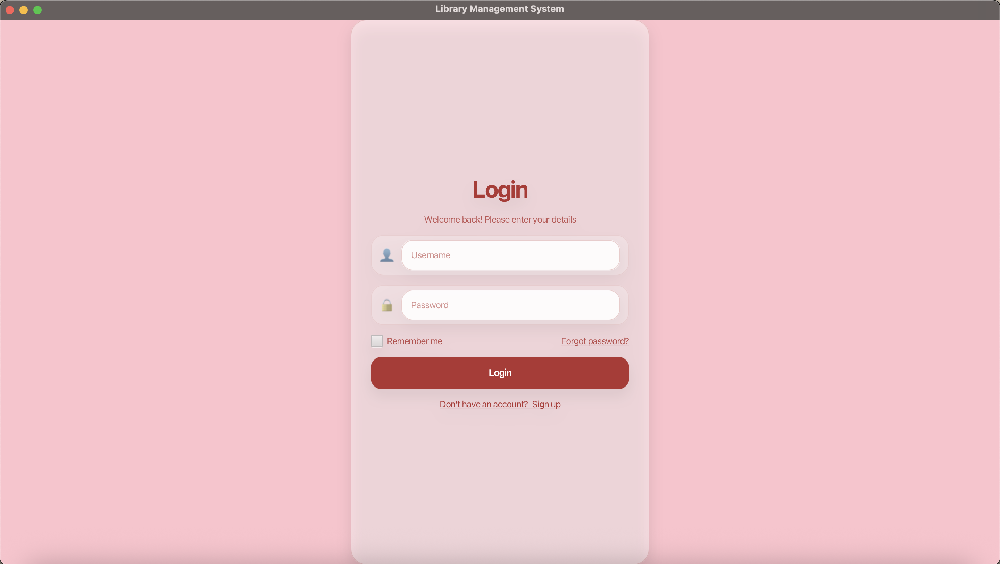
*Secure login interface for users to access the system*

### 3. User Registration
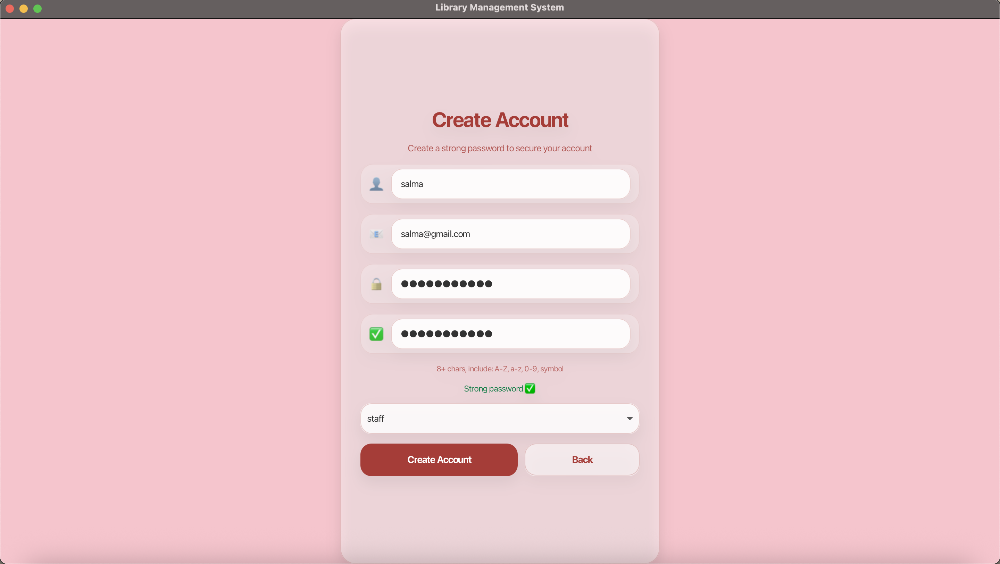
*Registration form for new users to create accounts*

### 4. Borrowers Management
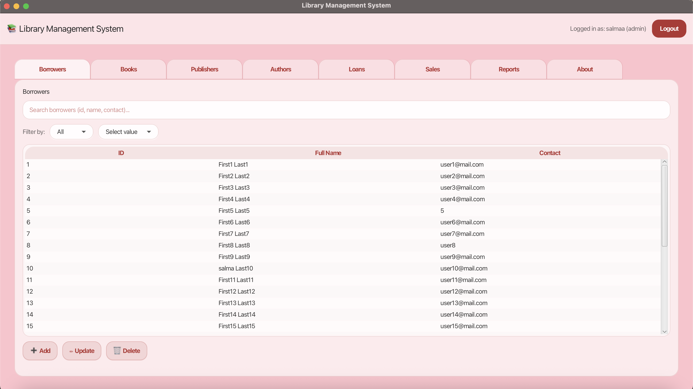
*Main borrowers management interface - first view after login*

### 5. CRUD Operations - Add New Record
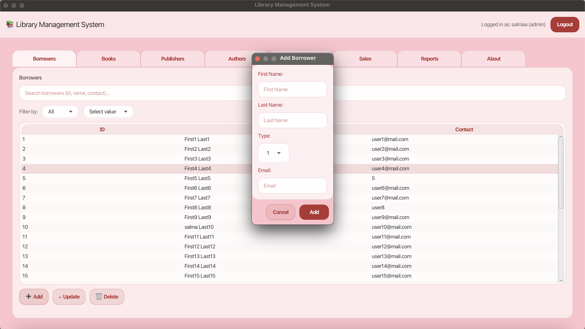
*Adding new records to the database (Books, Borrowers, Authors, etc.)*

### 6. CRUD Operations - Update Record
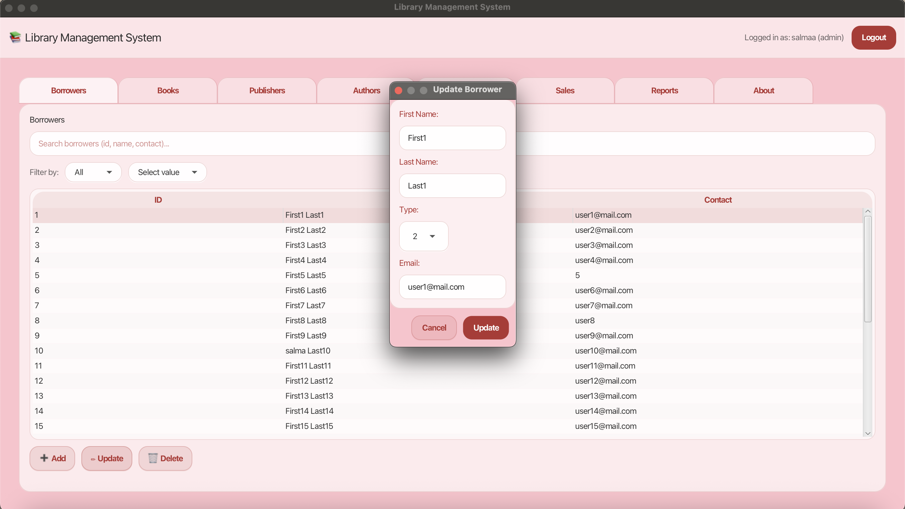
*Editing existing records with validation*

### 7. CRUD Operations - Delete Record
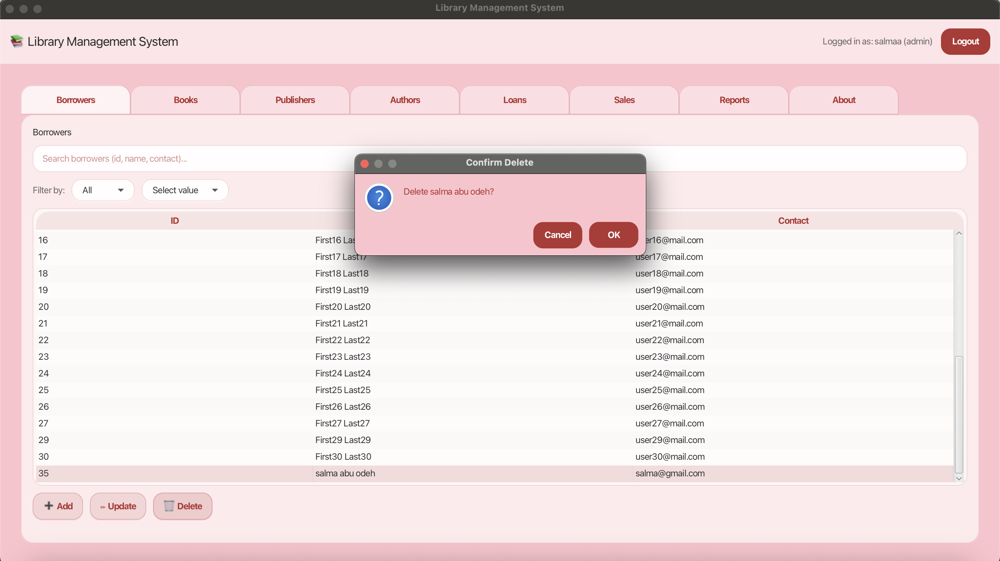
*Deleting records with confirmation dialog*

### 8. Reports & Analytics
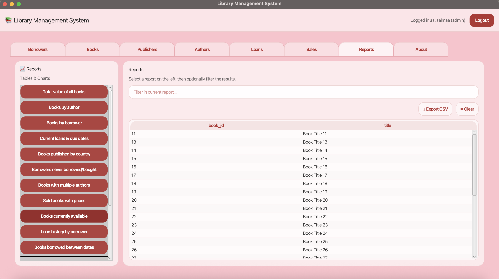
*Reports section showing "Books Currently Available" table results*

### 9. Books Distribution by Category
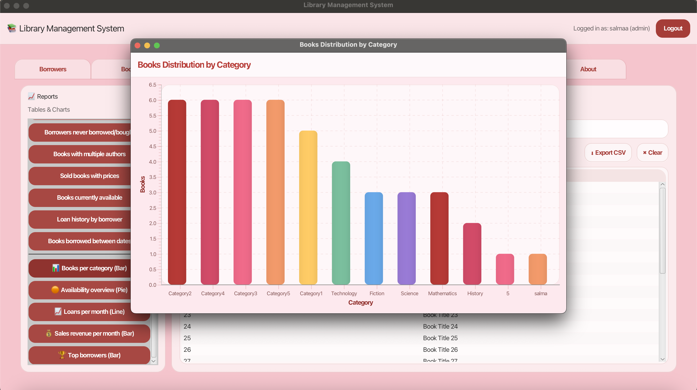
*Interactive bar chart showing book distribution across different categories*

### 10. Availability Overview
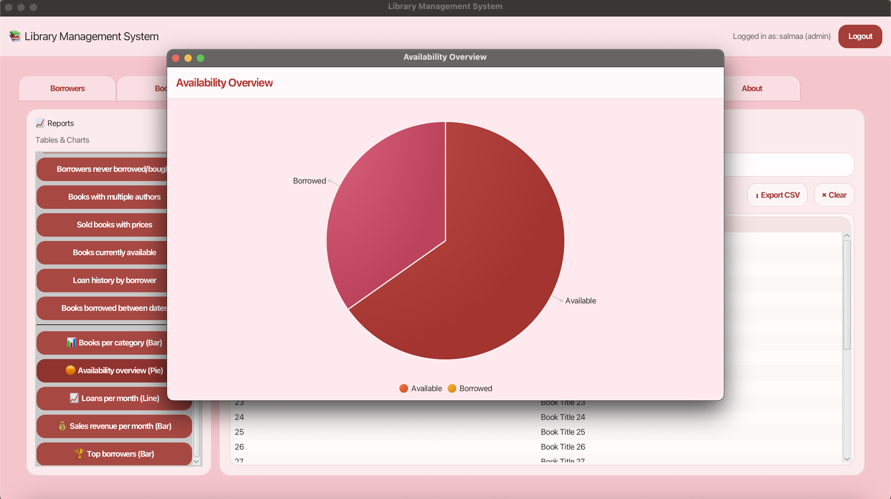
*Pie chart visualization of borrowed vs available books*

### 11. Sales Revenue Analysis
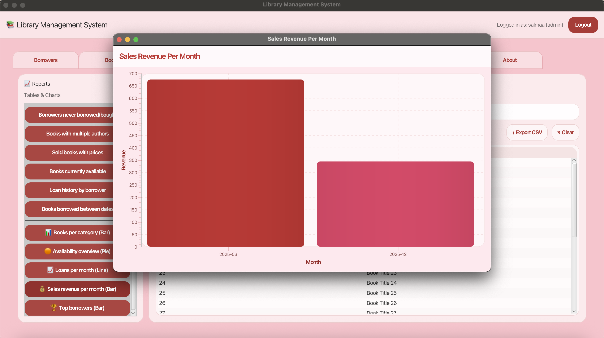
*Monthly sales revenue trends displayed in bar chart format*

### 12. About the Developer
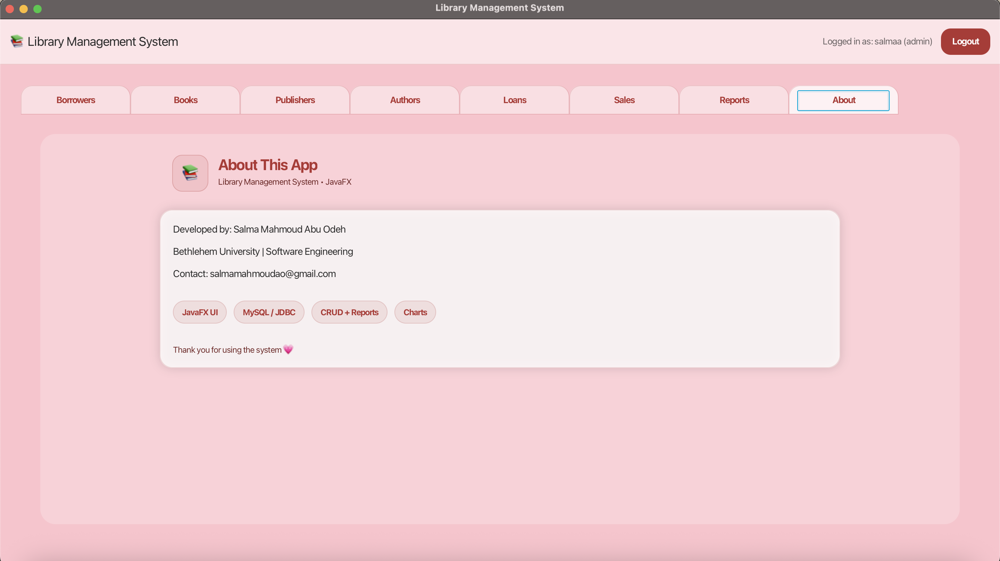
*Application information and developer contact details*

## 🛠️ Technologies Used

- **Frontend:** JavaFX 17+
- **Backend:** Java 11+
- **Database:** MySQL 8.0+
- **Build Tool:** Maven
- **Database Connectivity:** JDBC (MySQL Connector)
- **Charts:** JavaFX Charts API
- **UI Components:** JavaFX Controls, FXML

## 📋 Prerequisites

Before running this project, ensure you have the following installed:

- **Java JDK 11 or higher**
- **JavaFX SDK 17+**
- **MySQL Server 8.0+**
- **Maven 3.6+**
- **MySQL Connector/J** (JDBC Driver)

## 🚀 Installation & Setup

### 1. Clone the Repository
```bash
git clone https://github.com/salma-abuodeh/library-management-system-javafx-mysql.git
cd library-management-system-javafx-mysql
```

### 2. Database Setup

#### Create the Database
```sql
CREATE DATABASE my_library;
USE my_library;
```

#### Create Required Tables
The system uses the provided library database schema. Ensure you have the following tables:
- `books` - Book inventory
- `authors` - Author information
- `publishers` - Publisher details
- `borrowers` - Library members
- `loans` - Borrowing transactions
- `sales` - Book sales records
- `categories` - Book categorization

#### Create Users Table
```sql
CREATE TABLE Users (
    user_id INT PRIMARY KEY AUTO_INCREMENT,
    username VARCHAR(50) UNIQUE NOT NULL,
    password VARCHAR(255) NOT NULL,
    email VARCHAR(100) UNIQUE NOT NULL,
    role ENUM('admin', 'staff', 'student') NOT NULL,
    created_at TIMESTAMP DEFAULT CURRENT_TIMESTAMP
);

-- Insert default admin user
INSERT INTO Users (username, password, email, role) 
VALUES ('admin', 'hashed_password_here', 'admin@library.com', 'admin');
```

### 3. Configure Database Connection

The database connection is configured in `DatabaseConnection.java`:

```java
package org.example.project.db;

import java.sql.Connection;
import java.sql.DriverManager;
import java.sql.SQLException;

public class DatabaseConnection {
    private static final String URL  = "jdbc:mysql://localhost:3306/my_library?useSSL=false&serverTimezone=UTC";
    private static final String USER = "root";
    private static final String PASS = "";

    private DatabaseConnection() {}

    public static Connection getConnection() throws SQLException {
        return DriverManager.getConnection(URL, USER, PASS);
    }
}
```

**Note:** Update the `USER` and `PASS` variables if your MySQL has different credentials.

### 4. Build the Project
```bash
# Using Maven Wrapper (Recommended)
./mvnw clean install        # Unix/Mac
mvnw.cmd clean install      # Windows

# Or using Maven directly
mvn clean install
```

### 5. Run the Application
```bash
# Using Maven Wrapper
./mvnw javafx:run          # Unix/Mac
mvnw.cmd javafx:run        # Windows

# Or using Maven directly
mvn javafx:run
```

Or run directly from IntelliJ IDEA:
1. Open the project in IntelliJ IDEA
2. Right-click on `Launcher.java` or `ProjectApplication.java`
3. Select "Run"

## 📂 Project Structure

```
library-management-system-javafx-mysql/
├── src/
│   └── main/
│       ├── java/
│       │   └── org/example/project/
│       │       ├── dao/                    # Database Access Objects
│       │       ├── db/                     # Database Connection
│       │       │   └── DatabaseConnection.java
│       │       ├── model/                  # Data Models
│       │       │   ├── Author.java
│       │       │   ├── Book.java
│       │       │   ├── Borrower.java
│       │       │   ├── Loan.java
│       │       │   ├── Publisher.java
│       │       │   ├── Sale.java
│       │       │   └── User.java
│       │       ├── security/               # Security & Authentication
│       │       │   └── Passwords.java
│       │       ├── ui/                     # JavaFX Views & Controllers
│       │       │   ├── AboutView.java
│       │       │   ├── BackgroundUtil.java
│       │       │   ├── Charts.java
│       │       │   ├── Dialogs.java
│       │       │   ├── LoginView.java
│       │       │   ├── MainView.java
│       │       │   ├── SignupView.java
│       │       │   └── WelcomeView.java
│       │       ├── util/                   # Utility Classes
│       │       │   └── ValidationUtil.java
│       │       ├── Launcher.java           # Application Launcher
│       │       └── ProjectApplication.java # Main Application Class
│       └── resources/
│           └── org/example/project/
│               ├── app.css                 # Main Stylesheet
│               ├── chart-style.css         # Chart Styling
│               ├── background.png          # Background Image
│               └── main.png                # Application Logo
├── target/                                 # Compiled Output (generated)
├── .gitignore                              # Git Ignore File
├── mvnw                                    # Maven Wrapper (Unix)
├── mvnw.cmd                                # Maven Wrapper (Windows)
├── pom.xml                                 # Maven Configuration
└── README.md                               # Project Documentation
```

## 👥 User Roles & Permissions

| Feature | Admin | Staff | Student |
|---------|-------|-------|---------|
| View Data | ✅ | ✅ | ✅ |
| Search/Filter | ✅ | ✅ | ✅ |
| Insert Records | ✅ | ❌ | ❌ |
| Update Records | ✅ | ❌ | ❌ |
| Delete Records | ✅ | ❌ | ❌ |
| Access Reports | ✅ | ✅ | ✅ |
| Export Data | ✅ | ✅ | ✅ |

## 🔧 Configuration

### Database Configuration

The database connection is managed in `DatabaseConnection.java`. Update the following constants if needed:

```java
private static final String URL  = "jdbc:mysql://localhost:3306/my_library?useSSL=false&serverTimezone=UTC";
private static final String USER = "root";
private static final String PASS = "";  // Update this if your MySQL has a password
```

### MySQL Setup Requirements
- **Database Name:** `my_library`
- **Default User:** `root`
- **Default Password:** (empty) - Update if different
- **Port:** 3306 (default MySQL port)

### Default Admin Account
Create an admin account in the Users table after setting up the database:
```sql
INSERT INTO Users (username, password, email, role) 
VALUES ('admin', 'your_hashed_password', 'admin@library.com', 'admin');
```

**⚠️ Important:** Make sure to hash passwords before storing them in the database!

## 📊 Database Schema

The system uses the following main tables:

- **Users** - Authentication and authorization
- **Books** - Book inventory
- **Authors** - Author information
- **Publishers** - Publisher details
- **Borrowers** - Library members
- **Loans** - Borrowing transactions
- **Sales** - Book sales records
- **Categories** - Book categorization

## 🎯 Usage Guide

### For Admins
1. **Login** with admin credentials
2. **Manage Books:** Add, edit, or remove books from inventory
3. **Manage Users:** Create accounts for staff and students
4. **Process Loans:** Record borrowing and returns
5. **Generate Reports:** Access all analytical reports
6. **Export Data:** Download reports in CSV format

### For Staff
1. **Login** with staff credentials
2. **Search Books:** Find books using various filters
3. **View Reports:** Access read-only reports
4. **Assist Borrowers:** Help users find information

### For Students
1. **Login** with student credentials
2. **Browse Catalog:** View available books
3. **Check Availability:** See book availability status
4. **View Personal History:** Check borrowing history

## 🐛 Known Issues & Future Enhancements

### Current Limitations
- Single-user session (no concurrent multi-user support)
- Limited to local MySQL connection

### Planned Features
- [ ] Book reservation system
- [ ] Email notifications for due dates
- [ ] Fine calculation for overdue books
- [ ] Barcode scanning integration
- [ ] Mobile app companion
- [ ] Advanced analytics dashboard
- [ ] PDF export for reports
- [ ] Multi-language support

## 🤝 Contributing

Contributions are welcome! Please follow these steps:

1. Fork the repository
2. Create a feature branch (`git checkout -b feature/AmazingFeature`)
3. Commit your changes (`git commit -m 'Add some AmazingFeature'`)
4. Push to the branch (`git push origin feature/AmazingFeature`)
5. Open a Pull Request

## 📝 License

This project is developed as part of academic coursework at Bethlehem University. For academic and educational purposes.

## 📞 Contact & Support

**Developer:** Salma Mahmoud Abu Odeh  
**Email:** salmamahmoudao@gmail.com  
**Institution:** Bethlehem University  
**Department:** Software Engineering

For bugs, questions, or suggestions, please open an issue on GitHub.

## 🙏 Acknowledgments

- **Bethlehem University** - For academic support and resources
- **Database Management Systems Course (SWER351)** - Project foundation
- **JavaFX Community** - For excellent documentation and support
- **MySQL** - For robust database management

---

<div align="center">
  Made with ❤️ by Salma Mahmoud Abu Odeh

**Thank you for using the system! 💗**
</div>